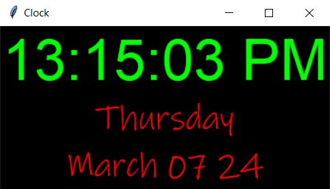

# ⏰ Clock_GUI_Tkinter

Welcome to a modern clock program developed using Python and Tkinter! This sleek desktop application not only tells you the current time but also displays the day of the week and the date.

## 🚦 Running the Project

To run the project in your local environment,Python must be installed on your system and follow these steps:

1. Clone the repository to your local machine.
2. Run `pip install tkinter` in the project directory to install the Tkinter library, which is usually included with Python installations.
3. Run `py clock_gui.py` or click on run `▶️` button to get the project started.

## 🦄 Features

- 👀 Real-time display of current time in hours, minutes, seconds, and AM/PM format.
- 🔄 Dynamic updates every second for accurate timekeeping.
- 🌓 Shows the current day of the week and date.
- 😊Stylish modern design with a black background and vibrant text colors.
- 😂 Resizable window.

## 🛠️ Main Technologies
- `Python`
  - `tkinter`
  - `time`

## 📝👩🏽‍🍳 Process

After I learned learned about Tkinter i need to create something out of it, So I made a nice clock program.

## 🤔 How Can It Be Improved?

- Add more vibrant color to the labels.
- Can improve UI.

## 🐛 Current Bug

So far, I'm not really sure if there are any bugs. However, there might be some issues. I tested it out on my computer (Windows 10), and so far it looks good there.

## 🍿 Preview

## 👇 Try it out!

[Click here!](https://github.com/malik-l0l/Clock_GUI_Tkinter/assets/clock.exe)
